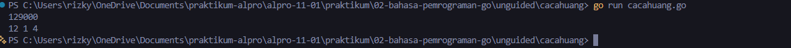
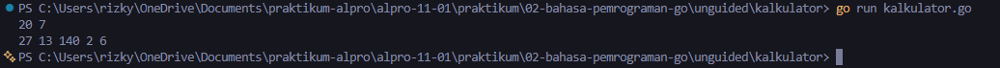

# <h1 align="center">Laporan Praktikum Modul 02 - Variabel, Tipe Data, dan Operasi Bahasa Pemrograman Go</h1>
<p align="center">[Rizky Fadlurrahman Ramadhan] - [109092630002]</p>

## Dasar Teori

### A. Pengenalan Bahasa Pemrograman Go
Go (atau Golang) adalah bahasa pemrograman open-source yang dikembangkan oleh Google untuk membangun perangkat lunak yang sederhana, cepat, dan efisien. Go merupakan bahasa yang bertipe statis dan dikompilasi langsung ke kode mesin, sehingga proses eksekusinya memiliki performa tinggi

### B. Package dan Struktur Program di Go

#### 1. Package `main` dan Fungsinya `main()`
Dimana setiap berkas program Go yang dapat dieksekusi harus berada dalam package utama yaitu `package main`. Titik awal eksekusi program selalu berada pada fungsi `func main()`. Untuk menangani masukan dan keluaran standar, Go menyediakan package bawaan `fmt`, seperti fungsi `fmt.Scan` untuk membaca masukan dan `fmt.Println` atau `fmt.Printf` untuk menampilkan keluaran

#### 2. Deklarasi Variabel dan Tipe Data
Go juga mendukung deklarasi variabel eksplisit menggunakan kata kunci `var` diikuti dengan tipe data (contoh: `var a int`, `var r float64`, atau `var nama string`), serta deklarasi ringkas menggunakan operator `:=` (contoh: `pi := 3.14`)

#### 3. Operasi Aritmatika dan Karakteristik Pembagian
Didalam Go menyediakan sebuah operator aritmatika standar seperti penjumlahan (`+`), pengurangan (`-`), perkalian (`*`), pembagian (`/`), dan sisa hasil bagi atau modulo (`%`).
- **Pembagian Bilangan Bulat (*Integer Division*):** Operasi pembagian antar bilangan bulat (`int / int`) akan menghasilkan bilangan bulat di mana nilai pecahan/sisa baginya dibuang (*truncated*).
- **Pembagian Bilangan Riil:** Untuk mempertahankan nilai desimal, salah satu atau kedua operan harus berupa bilangan pecahan/riil (seperti `4.0 / 5.0` atau tipe `float64`). Jika ditulis `4 / 5`, compiler Go menganggapnya pembagian bilangan bulat yang bernilai `0`.

## Guided

### 1. skor.go

```go
package main

import "fmt"

func main() {
	var nama string
	var matematika, bahasaInggris int
	
	//membaca input dari user
	fmt.Scan(&nama, &matematika, &bahasaInggris)

	//menghitung total dan rata-rata
	total := matematika + bahasaInggris
	rataRata := total / 2

	//menampilkan output dari user
	fmt.Println(nama)
	fmt.Println(total)
	fmt.Println(rataRata)
}
```
#### Deskripsi
Jadi program ini membaca masukan berupa nama siswa (string), skor matematika (int), dan skor bahasa Inggris (int). Lalu program kemudian menghitung total kedua nilai dan rata-ratanya dengan pembagian bilangan bulat (total / 2) sehingga sisa hasil bagi dibuang, lalu menampilkan nama, nilai total, dan rata-rata pada baris yang terpisah

### 2. tukar.go

```go
package main

import "fmt"

func main() {
	var a, b int
	fmt.Scan(&a, &b)
	a, b = b, a
	fmt.Println(a, b)
}
```
#### Deskripsi
Program ini bertujuan mempertukarkan nilai dari dua buah variabel bilangan bulat a dan b. Pertukaran dilakukan secara efisien menggunakan fitur tuple assignment bawaan Go (a, b = b, a), kemudian mencetak hasilnya secara berurutan sesuai format tugas

### 3. lingkaran.go

```go
package main

import "fmt"

func main() {
	pi := 3.14
	var r, luas float64
	fmt.Scan(&r)
	luas = pi * r * r
	fmt.Println(luas)
}
```

#### Deskripsi
Program ini menghitung luas bidang lingkaran berdasarkan jari-jari r yang diinputkan pengguna. Mengikuti petunjuk modul, variabel pi dideklarasikan dengan pi := 3.14, serta r dan luas bertipe float64 agar mampu menampung bilangan riil berpresisi desimal

### 4. suhu.go

```go
package main

import "fmt"

func main() {
	var celsius, reamur, fahrenheit, kelvin float64

	fmt.Scan(&celsius)

	reamur = celsius * 4.0 / 5.0
	fahrenheit = (celsius * 9.0 / 5.0) + 32.0
	kelvin = celsius + 273.15

	fmt.Println(reamur, fahrenheit, kelvin)
}
```

#### Deskripsi
Program ini mengonversi besaran suhu dari skala derajat Celsius ke skala Reamur, Fahrenheit, dan Kelvin. Perhitungan dilakukan dengan menggunakan konstanta pecahan bilangan riil seperti 4.0 / 5.0 dan 9.0 / 5.0 agar Go memprosesnya sebagai pembagian desimal berpresisi tepat

## Unguided

### 1. cacahuang.go

```go
package main

import "fmt"

func main() {
	var nominal int

	// Membaca masukan nominal uang
	fmt.Scan(&nominal)

	// Hitung lembar sepuluh ribu
	sepuluhRibu := nominal / 10000
	sisa := nominal % 10000

	// Hitung lembar lima ribu dari sisa sebelumnya
	limaRibu := sisa / 5000
	sisa = sisa % 5000

	// Hitung lembar seribu dari sisa sebelumnya
	seribu := sisa / 1000

	// Tampilkan hasil berupa tiga bilangan bulat dipisahkan spasi
	fmt.Printf("%d %d %d\n", sepuluhRibu, limaRibu, seribu)
}
```

##### Output
<!-- Path relatif dari readme.md ke folder unguided/[nama_soal]/output.png, contoh: -->



#### Deskripsi
Jadi dalam program ini, memecah sejumlah nominal uang rupiah menjadi lembaran pecahan sepuluh ribu, lima ribu, dan seribu rupiah dengan prinsip jumlah lembar sesedikit mungkin. Setelah itu, program menerapkan operator pembagian bulat / untuk mendapatkan lembaran dan modulo % untuk menghitung sisa nilai uang yang belum terpecah. Sisa uang di bawah pecahan seribu rupiah secara otomatis terabaikan

### 2. kalkulator.go

```go
package main

import "fmt"

func main() {
	var a, b int
	fmt.Scan(&a, &b)

	tambah := a + b
	kurang := a - b
	kali := a * b
	bagi := a / b
	sisa := a % b

	fmt.Printf("%d %d %d %d %d\n", tambah, kurang, kali, bagi, sisa)
}
```

##### Output


#### Deskripsi
Program kalkulator membaca dua buah bilangan bulat $a$ dan $b$ ($b \neq 0$). Program kemudian menghitung lima operasi aritmatika: penjumlahan, pengurangan, perkalian, pembagian bilangan bulat, dan sisa hasil bagi (modulo). Hasilnya ditampilkan dalam satu baris dengan pemisah spasi

<!-- Duplikasi blok "### [nama_soal]" sesuai jumlah folder soal di dalam unguided -->


## Kesimpulan
Berdasarkan praktikum Modul 02 yang telah dilakukan, dapat kita simpulkan bahwa:

1. Penulisan kode program Go selalu diawali dengan deklarasi `package main` dan fungsi utama `func main()`, serta menggunakan modul `fmt` untuk proses membaca input pengguna melalui `fmt.Scan` dan menampilkan hasil dengan `fmt.Println`
2. Pemilihan tipe data yang tepat sangat berpengaruh terhadap hasil perhitungan. Teks disimpan menggunakan tipe data `string`, angka bulat menggunakan `int`, sedangkan angka desimal menggunakan `float64`
3. Pada operasi pembagian bilangan bulat (`int`), sisa hasil bagi akan langsung diabaikan atau dibuang. Jika membutuhkan hasil yang berbentuk desimal, perhitungan harus menggunakan format pecahan riil (seperti `4.0 / 5.0`) agar nilainya tidak menjadi nol
4. Penggunaan operator pembagian (`/`) dan sisa bagi (`%`) sangat membantu dalam menyelesaikan perhitungan bertingkat, seperti pembagian pecahan uang. Selain itu, Go memudahkan proses pertukaran nilai antarvariabel secara langsung tanpa perlu membuat variabel bantuan tambahan

## Referensi
1. Donovan, A. A., & Kernighan, B. W. (2015). *The Go Programming Language*. Boston: Addison-Wesley. Diakses pada 25 September 2026 melalui https://www.gopl.io/
2. The Go Authors. (2024). *The Go Programming Language Specification*. Google LLC. Diakses pada 25 September 2026 melalui https://go.dev/ref/spec
3. The Go Authors. (2024). *Package fmt - The Go Programming Language*. Google LLC. Diakses pada 25 September 2026 melalui https://pkg.go.dev/fmt