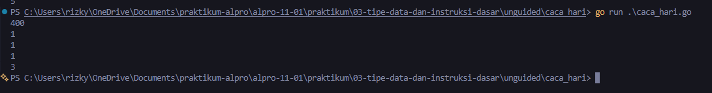

# <h1 align="center">Laporan Praktikum Modul 03 - “VARIABEL DAN OPERATOR”</h1>
<p align="center">[Rizky Fadlurrahman ramadhan] - [109092630002]</p>

## Dasar Teori

### A. Variabel dan Tipe Data di Go
Variabel merupakan tempat penyimpanan dalam memori komputer untuk menampung data selama program berjalan. Yang dimana, bahasa Go menggunakan sistem statically typed, yang artinya setiap variabel wajib memiliki tipe data yang pasti sejak awal dan tidak bisa diisi sembarang tipe lain di tengah proses

### B. Operator Aritmatika dan Assignment

#### 1. Operator Aritmatika dan Modulo
Go menyediakan operator hitung standar seperti +, -, *, dan /. Pada tipe bilangan bulat (int), operasi pembagian (/) akan memotong nilai pecahan. Untuk mendapatkan sisa hasil pembagian antarbilangan bulat, Go menggunakan operator modulo (%) yang berguna memecah nominal atau satuan waktu

#### 2. Pertukaran Nilai (Multiple Assignment)
Go mendukung fitur multiple assignment untuk mengisi nilai ke beberapa variabel sekaligus dalam satu baris instruksi. Fitur ini memungkinkan pertukaran nilai antarvariabel (seperti x, y, z = z, x, y) berlangsung langsung tanpa memerlukan variabel penampung sementara

<!-- Tambahkan poin A, B, C, ... atau sub-topik 1, 2, 3, ... sesuai kebutuhan modul -->

## Guided

### 1. konversi.go

```go
package main

import "fmt"

func main() {
	var celcius float64

	fmt.Print("Masukkan suhu: ")
	fmt.Scan(&celcius)

	fmt.Println(celcius + 273)
}
```
#### Deskripsi
Program ini berfungsi menghitung konversi suhu Celsius ke Kelvin. Input suhu dibaca dan disimpan ke variabel celcius bertipe float64. Selanjutnya, hasil konversi dihitung langsung pada fungsi fmt.Println menggunakan rumus penambahan konstanta 273, lalu dicetak di Terminal

### 2. tukar.go

```go
package main

import "fmt"

func main() {
	var x, y, z int
	fmt.Scan(&x, &y, &z)

	temp := x
	x = z
	z = y
	y = temp

	fmt.Println(x, y, z)
}
```
#### Deskripsi
Program ini berfungsi melakukan pergeseran/pertukaran isi nilai tiga variabel integer. Masukan x, y, dan z diproses menggunakan variabel perantara temp guna menampung nilai awal x sebelum dilakukan penugasan ulang nilai secara bergantian (x = z, z = y, dan y = temp). Hasil ketiga variabel setelah pertukaran kemudian ditampilkan langsung menggunakan fmt.Println

### 3. kasir.go

```go
package main

import "fmt"

func main() {
	var x int
	fmt.Scan(&x)

	var sepuluhRibuan int = x / 10000
	var sisa int = x % 10000

	var limaRibuan int = sisa / 5000
	sisa = sisa % 5000

	var seribuan int = sisa / 1000

	fmt.Println(sepuluhRibuan, limaRibuan, seribuan)
}
```
#### Deskripsi
Program ini memecah nilai total kembalian x ke dalam tiga nominal pecahan uang kasir. Perhitungan dilakukan bertingkat mulai dari pecahan terbesar dengan membagi nominal untuk memperoleh kuota lembar (sepuluhRibuan, limaRibuan, seribuan), serta menggunakan sisa bagi modulo (%) untuk memperbarui sisa nilai yang akan dihitung berikutnya

## Unguided

### 1. konversi_suhu_c

```go
package main

import "fmt"

func main() {
	var c, r float64
	fmt.Scan(&c)
	r = (4.0 / 5.0) * c
	fmt.Println(r)
}
```

##### Output
<!-- Path relatif dari readme.md ke folder unguided/[nama_soal]/output.png, contoh: -->


#### Deskripsi
Program ini berfungsi menghitung konversi suhu dari Celsius ke Reamur. Variabelnya memakai tipe float64 supaya perhitungan angka desimal tetap akurat. Nilai Celsius yang diinput pengguna dikalikan dengan pecahan 4.0 / 5.0 agar operasinya terbaca sebagai desimal dan menghasilkan nilai yang tepat

### 2. caca_hari

```go
package main

import "fmt"

func main() {
	var totalHari int
	fmt.Scan(&totalHari)

	var tahun int = totalHari / 360
	var sisa int = totalHari % 360

	bulan := sisa / 30
	sisa = sisa % 30

	minggu := sisa / 7
	hari := sisa % 7

	fmt.Println(tahun)
	fmt.Println(bulan)
	fmt.Println(minggu)
	fmt.Println(hari)
}
```

##### Output


#### Deskripsi
Program ini berfungsi mengonversi jumlah hari menjadi satuan tahun, bulan, minggu, dan sisa hari. Nilai hari yang diinput diproses bertahap dari satuan terbesar menggunakan pembagian (/) untuk memperoleh unit waktu dan modulo (%) untuk memperbarui sisa hari yang belum terbagi. Semua variabel memakai tipe integer karena angkanya bulat, lalu hasilnya dicetak berurutan ke bawah

<!-- Duplikasi blok "### [nama_soal]" sesuai jumlah folder soal di dalam unguided -->


## Kesimpulan
Dari praktikum ini, intinya kita belajar pentingnya milih tipe data yang pas: data bulat seperti uang dan hari cukup pakai int, sedangkan suhu wajib float64 biar hasil desimalnya nggak kepotong. Selain itu, kombinasi bagi (/) dan modulo (%) kepake banget buat mecah nilai bertahap, serta pertukaran variabel di Go bisa dilakukan secara fleksibel pakai variabel bantuan maupun multiple assignment

## Referensi
1. The Go Authors. (2024). The Go Programming Language Specification. Diakses melalui https://go.dev/ref/spec
2. Donovan, A. A., & Kernighan, B. W. (2015). The Go Programming Language. New York: Addison-Wesley
3. Laboratorium Praktikum Informatika. (2025). Modul 03: Variabel dan Operator - Algoritma dan Pemrograman. Bandung: Fakultas Informatika, Universitas Telkom
<!-- Tambahkan nomor referensi berikutnya sesuai kebutuhan -->
