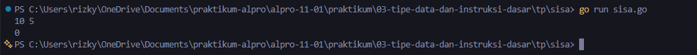
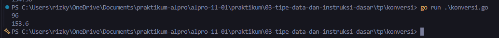
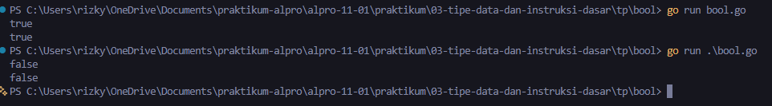

# <h1 align="center">Tugas Pendahuluan Modul 03 - “VARIABEL DAN OPERATOR” </h1>
<p align="center">[Rizky Fadlurrahman ramadhan] - [109092630002]</p>

### 1. sisa.go

```.go
package main

import "fmt"

func main() {
	var y, x int
	fmt.Scan(&y, &x)
	sisa := y % x
	fmt.Println(sisa)
}
```

##### Output
<!-- Path relatif dari readme.md ke folder unguided/[nama_soal]/output.png, contoh: -->



#### Deskripsi
Jadi code Program ini membaca dua buah bilangan bulat, yaitu $y$ sebagai (jumlah kue) dan $x$ sebagai (jumlah anggota). Untuk mencari sisa kue setelah dibagikan sama rata menggunakan operator modulo (%)

### 2. konversi.go

```go
package main

import "fmt"

func main() {
	var mil float64
	fmt.Scan(&mil)
	km := mil * 1.6
	fmt.Printf("%.1f\n", km)
}
```

##### Output
<!-- Path relatif dari readme.md ke folder unguided/[nama_soal]/output.png, contoh: -->



#### Deskripsi
Program ini memakai tipe float64 karena angkanya merupakan desimal. Angka mil yang diinput dikali dengan 1.6, terus dicetak pakai %.1f biar pas satu angka di belakang koma


### 3. bool.go

```go
package main

import "fmt"

func main() {
	var b bool
	fmt.Scan(&b)
	fmt.Println(b)
}
```

##### Output
<!-- Path relatif dari readme.md ke folder unguided/[nama_soal]/output.png, contoh: -->



#### Deskripsi
Program ini tugasnya cuma menerima input true atau false ke dalam variabel bertipe bool, terus langsung diprint lagi apa adanya ke layar

## Kesimpulan
Kesimpulan tugas ini fokus ke dasar input-output sebuah nilai: pemakaian modulo (%) pada bilangan bulat, penanganan data logika (bool), dan perhitungan desimal (float64) dengan format output yang rapih