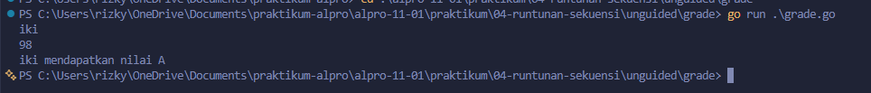
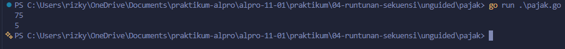

# <h1 align="center">Laporan Praktikum Modul 04 - “RUNTUNAN/SEKUENSI”</h1>
<p align="center">[Rizky Fadlurrahman ramadhan] - [109092630002]</p>

## Dasar Teori

### A. Operator Perbandingan dan Logika di Go

#### 1. Operator Perbandingan
Operator seperti >, <, >=, <=, ==, dan != membandingkan dua nilai dan menghasilkan boolean (true atau false). Hasilnya dipakai sebagai kondisi pada percabangan.

#### 2. Operator Logika
Operator && (AND) bernilai true jika kedua sisi benar, || (OR) jika salah satu sisi benar, dan ! (NOT) membalik nilai boolean. Urutan evaluasinya: ! lebih dulu, lalu &&, kemudian ||.

### B. Percabangan

#### 1. If - Else If - Else
Percabangan ini menjalankan blok kode sesuai kondisi yang terpenuhi. Pengecekan dilakukan dari atas ke bawah dan berhenti pada kondisi pertama yang benar.

#### 2. Switch Case
Switch adalah alternatif if - else if yang lebih rapi untuk banyak kondisi. Di Go, switch bisa ditulis tanpa ekspresi dan langsung keluar setelah satu case cocok, sehingga tidak perlu break.

## Guided

### 1. grade.go

```go
package main

import (
	"bufio" // Digunakan untuk membaca masukan string yang memiliki spasi
	"fmt"
	"os" // Menyediakan akses ke sistem operasi, dalam hal ini os.Stdin (keyboard)
)

func main() {
	var nama string
	var nilai float64
	var grade string

	// Membuat alat pembaca (scanner) baru yang mengambil masukan dari keyboard
	scanner := bufio.NewScanner(os.Stdin)

	// Proses membaca masukan dari pengguna sampai tombol Enter ditekan
	scanner.Scan()

	// Mengambil teks yang baru saja dibaca dan menyimpannya ke variabel nama
	nama = scanner.Text()

	fmt.Scan(&nilai)

	if nilai >= 90 && nilai <= 100 {
		grade = "A"
	} else if nilai >= 80 && nilai < 90 {
		grade = "B"
	} else if nilai >= 70 && nilai < 80 {
		grade = "C"
	} else if nilai >= 60 && nilai < 70 {
		grade = "D"
	} else {
		grade = "F"
	}

	// %s adalah format penulisan (placeholder) untuk mencetak nilai bertipe string
	// %s pertama akan diisi oleh variabel 'nama', %s kedua diisi oleh 'grade'
	fmt.Printf("%s mendapatkan nilai %s\n", nama, grade)
}
```

#### Deskripsi
Program ini menentukan nilai huruf (A-F) dari nilai angka siswa. Nama dibaca satu baris penuh dengan bufio.Scanner, lalu nilai diperiksa dengan if - else if per rentang: 90-100 A, 80-89 B, 70-79 C, 60-69 D, selebihnya F.

### 2. penilaian.go

```go
package main

import (
	"bufio" // Digunakan untuk membaca masukan string yang memiliki spasi (seperti nama lengkap)
	"fmt"
	"os" // Menyediakan akses ke sistem operasi, dalam hal ini os.Stdin yang merepresentasikan keyboard
)

func main() {
	// Pendefinisian variabel secara eksplisit beserta tipe datanya
	var pilihan int
	var nama string
	var nilai float64
	var grade string

	// Menampilkan cetakan Menu ke layar
	fmt.Println("============= Menu =============")
	fmt.Println("1. Sistem penilaian")
	fmt.Println("0. Keluar")
	fmt.Print("Pilih opsi: ")

	// Membaca masukan pilihan (angka).
	// Kita menggunakan Scanln agar saat user menekan 'Enter', karakter enter tersebut
	// ikut diolah/dibersihkan dan tidak melompat (mengganggu) masukan nama di bawahnya.
	fmt.Scanln(&pilihan)

	// Percabangan/Sekuensi bersyarat berdasarkan input pengguna
	if pilihan == 1 {
		fmt.Print("Masukkan nama siswa: ")

		// Membuat alat pembaca (scanner) baru yang mengambil masukan dari keyboard
		scanner := bufio.NewScanner(os.Stdin)

		// Proses membaca masukan dari pengguna sampai tombol Enter ditekan
		scanner.Scan()

		// Mengambil teks (nama) yang baru saja dibaca dan menyimpannya ke variabel
		nama = scanner.Text()

		fmt.Print("Masukkan nilai siswa: ")
		fmt.Scanln(&nilai)

		// Menentukan grade nilai
		if nilai >= 90 && nilai <= 100 {
			grade = "A"
		} else if nilai >= 80 && nilai < 90 {
			grade = "B"
		} else if nilai >= 70 && nilai < 80 {
			grade = "C"
		} else if nilai >= 60 && nilai < 70 {
			grade = "D"
		} else {
			grade = "F"
		}

		// %s adalah format (placeholder) untuk mencetak data bertipe string
		// %s pertama akan digantikan oleh isi variabel 'nama', %s kedua oleh 'grade'
		fmt.Printf("%s mendapatkan nilai %s\n", nama, grade)

	} else if pilihan == 0 {
		// Dijalankan jika pengguna mengetik 0
		fmt.Println("Keluar dari program.")

	} else {
		// Dijalankan jika pengguna mengetik angka selain 1 dan 0
		fmt.Println("Pilihan tidak valid.")
	}
}
```

#### Deskripsi
Program ini menampilkan menu penilaian dan keluar. Pilihan 1 menjalankan penilaian seperti grade.go, pilihan 0 mencetak "Keluar dari program.", dan pilihan lain mencetak "Pilihan tidak valid." lalu berhenti.

### 3. klasifikasi.go

```go
package main

import (
	"fmt" // Hanya memerlukan fmt untuk keperluan input dan output
)

func main() {
	// Pendefinisian variabel secara eksplisit beserta tipe datanya
	var usia int
	var gaji int
	var keterangan string

	// Membaca dua masukan berupa angka dari pengguna (usia dan gaji)
	// fmt.Scan otomatis memisahkan input berdasarkan spasi atau baris baru (enter)
	fmt.Scan(&usia)
	fmt.Scan(&gaji)

	// Menggunakan switch tanpa ekspresi.
	// Cara kerjanya sama persis seperti deretan if - else if.
	// Program akan mengecek dari atas ke bawah, dan menjalankan case pertama yang bernilai benar (true).
	switch {
	case usia < 18:
		keterangan = "Masih sekolah"
	case usia >= 18 && usia <= 25 && gaji >= 50:
		keterangan = "Muda sukses"
	case usia >= 18 && usia <= 25 && gaji < 50:
		keterangan = "Masih belajar hidup"
	case usia >= 26 && usia <= 40 && gaji >= 100:
		keterangan = "Pekerja mapan"
	case usia >= 26 && usia <= 40 && gaji < 100:
		keterangan = "Perlu perbaikan karier"
	case usia > 40 && gaji >= 150:
		keterangan = "Profesional berpengalaman"
	case usia > 40 && gaji < 150:
		keterangan = "Perlu evaluasi finansial"
	}

	// Menampilkan hasil klasifikasi ke layar
	fmt.Println(keterangan)
}
```

#### Deskripsi
Program ini mengelompokkan seseorang berdasarkan usia dan gaji tahunan memakai switch tanpa ekspresi. Case diperiksa berurutan dari atas, dan case pertama yang bernilai true menentukan keterangannya.

## Unguided

### 1. grade (switch)

```go
package main

import (
	"bufio"
	"fmt"
	"os"
)

func main() {
	var nama string
	var nilai float64
	var grade string

	scanner := bufio.NewScanner(os.Stdin)
	scanner.Scan()

	nama = scanner.Text()

	fmt.Scan(&nilai)

	switch {
	case nilai >= 90 && nilai <= 100:
		grade = "A"
	case nilai >= 80 && nilai < 90:
		grade = "B"
	case nilai >= 70 && nilai < 80:
		grade = "C"
	case nilai >= 60 && nilai < 70:
		grade = "D"
	default:
		grade = "F"
	}

	fmt.Printf("%s mendapatkan nilai %s\n", nama, grade)
}
```

##### Output


#### Deskripsi
Program ini adalah grade.go yang diubah memakai switch. Switch tanpa ekspresi memeriksa rentang nilai dari tertinggi, dengan F sebagai default.

### 2. pajak

```go
package main

import "fmt"

func main() {
	var penghasilan float64
	var pajak float64

	fmt.Scan(&penghasilan)

	if penghasilan <= 50 {
		pajak = 0.05 * penghasilan
	} else if penghasilan <= 100 {
		pajak = 0.05*50 + 0.10*(penghasilan-50)
	} else if penghasilan <= 200 {
		pajak = 0.05*50 + 0.10*50 + 0.15*(penghasilan-100)
	} else {
		pajak = 0.05*50 + 0.10*50 + 0.15*100 + 0.20*(penghasilan-200)
	}

	fmt.Println(pajak)
}
```

##### Output


#### Deskripsi
Program ini menghitung pajak penghasilan (juta) dengan if - else if - else. Pajak dihitung bertahap per lapisan: 5%, 10%, 15%, dan 20% sesuai bracket penghasilan.

## Kesimpulan
Praktikum ini melatih pembuatan program yang memilih alur berdasarkan kondisi. If - else if cocok untuk kondisi bertingkat seperti pajak, sedangkan switch membuat pengelompokan seperti nilai huruf lebih rapi.

## Referensi
1. The Go Authors. (2024). The Go Programming Language Specification. Diakses melalui https://go.dev/ref/spec
2. Donovan, A. A., & Kernighan, B. W. (2015). The Go Programming Language. New York: Addison-Wesley
3. Laboratorium Praktikum Informatika. (2025). Modul 04: Runtunan/Sekuensi - Algoritma dan Pemrograman. Bandung: Fakultas Informatika, Universitas Telkom