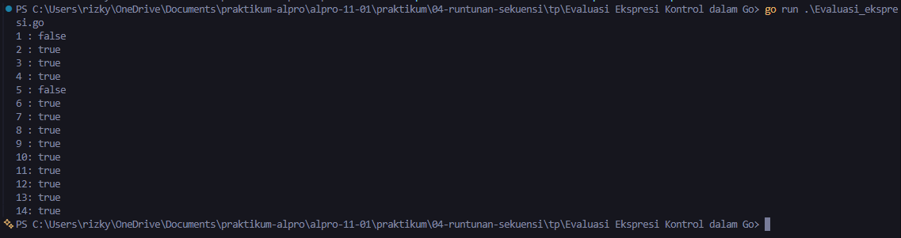
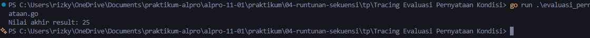
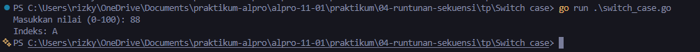

# <h1 align="center">Tugas Pendahuluan Modul 04 - “RUNTUNAN/SEKUENSI” </h1>
<p align="center">[Rizky Fadlurrahman ramadhan] - [109092630002]</p>

### 1. Evaluasi_ekspresi.go

```.go
package main

import "fmt"

func main() {
	intNum := 5
	intOther := 10
	var sngNum float64 = -3

	fmt.Println("1 :", intNum > 5)
	fmt.Println("2 :", intNum >= 5 && intOther < 11)
	fmt.Println("3 :", sngNum != -1 || intOther < 0)
	fmt.Println("4 :", !(intNum > 3) || intNum <= 5)
	fmt.Println("5 :", !(intOther >= intNum))
	fmt.Println("6 :", 0-sngNum > 0)
	fmt.Println("7 :", 4/2 == intOther/intNum)
	fmt.Println("8 :", intOther%2 == 0)
	fmt.Println("9 :", intOther+2*intNum != 30 || !(sngNum > 0))
	fmt.Println("10:", intOther > 0 && intNum > 0 || sngNum > 0)
	fmt.Println("11:", sngNum > 0 || (intNum >= 0 && -1*intOther == -10))
	fmt.Println("12:", intNum == 5)
	fmt.Println("13:", intNum > 0 || (sngNum <= 0 && intOther == 13))
	fmt.Println("14:", !(!(!(!(intNum > 0)))))
}
```

##### Output
<!-- Path relatif dari readme.md ke folder unguided/[nama_soal]/output.png, contoh: -->



#### Deskripsi
Dengan intNum = 5, intOther = 10, dan sngNum = -3, hanya nomor 1 dan 5 yang false, sedangkan nomor lainnya true.

### 2. evaluasi_pernyataan.go

```go
package main

import "fmt"

func main() {
	x := 10
	y := 5
	z := 15
	result := 0

	if x > 5 {
		if y < 10 {
			result = x + y
		} else {
			result = x - y
		}
	}

	if z > 10 && x == 10 {
		result += z
	} else {
		result = z - x
	}

	if x == 10 || y > 10 {
		result += 5
	} else if y == 5 && z > 10 {
		result -= 5
	} else {
		result *= 2
	}

	if !(x < 15 && y < 10) {
		result += 10
	} else {
		result -= 10
	}

	fmt.Println("Nilai akhir result:", result)
}
```

##### Output
<!-- Path relatif dari readme.md ke folder unguided/[nama_soal]/output.png, contoh: -->



#### Deskripsi
Nilai awal result = 0, lalu berubah menjadi 15, 30, 35, dan akhirnya 25. Output: Nilai akhir result: 25


### 3. Jumlah_hari.go

```go
package main

import "fmt"

func main() {
	var tahun int
	var bulan string

	fmt.Scan(&tahun, &bulan)

	kabisat := (tahun%4 == 0 && tahun%100 != 0) || tahun%400 == 0

	switch bulan {
	case "Jan", "Mar", "Mei", "Jul", "Agu", "Okt", "Des":
		fmt.Println(31)
	case "Apr", "Jun", "Sep", "Nov":
		fmt.Println(30)
	case "Feb":
		if kabisat {
			fmt.Println(29)
		} else {
			fmt.Println(28)
		}
	default:
		fmt.Println("-")
	}
}
```

##### Output
<!-- Path relatif dari readme.md ke folder unguided/[nama_soal]/output.png, contoh: -->


#### Deskripsi
Program membaca tahun dan bulan, mengecek tahun kabisat, lalu switch menentukan jumlah harinya (31, 30, atau 28/29 untuk Februari). Bulan yang tidak valid mencetak "-"

### 3. switch_case.go

```go
package main

import "fmt"

func main() {
	var nilai int
	fmt.Print("Masukkan nilai (0-100): ")
	fmt.Scan(&nilai)

	switch {
	case nilai >= 80 && nilai <= 100:
		fmt.Println("Indeks: A")
	case nilai >= 70:
		fmt.Println("Indeks: B")
	case nilai >= 60:
		fmt.Println("Indeks: C")
	case nilai >= 0:
		fmt.Println("Indeks: D")
	default:
		fmt.Println("Nilai tidak valid")
	}
}
```

##### Output
<!-- Path relatif dari readme.md ke folder unguided/[nama_soal]/output.png, contoh: -->



#### Deskripsi
Program membaca nilai, lalu switch menentukan indeksnya (A, B, C, atau D). Nilai di luar 0-100 menampilkan "Nilai tidak valid"

## Kesimpulan
Keempat soal ini melatih penggunaan percabangan dalam Go. Soal 1 dan 2 menunjukkan bahwa hasil sebuah kondisi ditentukan oleh operator perbandingan (>, ==, dst.) dan operator logika (&&, ||, !), serta urutan evaluasinya, sehingga alur program dan nilai akhir variabel bisa dilacak secara manual. Soal 3 dan 4 menerapkan switch case untuk memilih tindakan berdasarkan nilai tertentu, seperti menentukan jumlah hari dalam sebulan (termasuk tahun kabisat) dan indeks nilai. Secara keseluruhan, pemahaman kondisi if dan switch membuat program mampu mengambil keputusan sesuai input yang diberikan